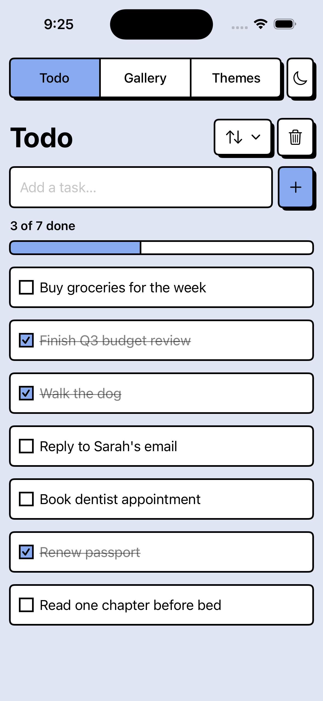
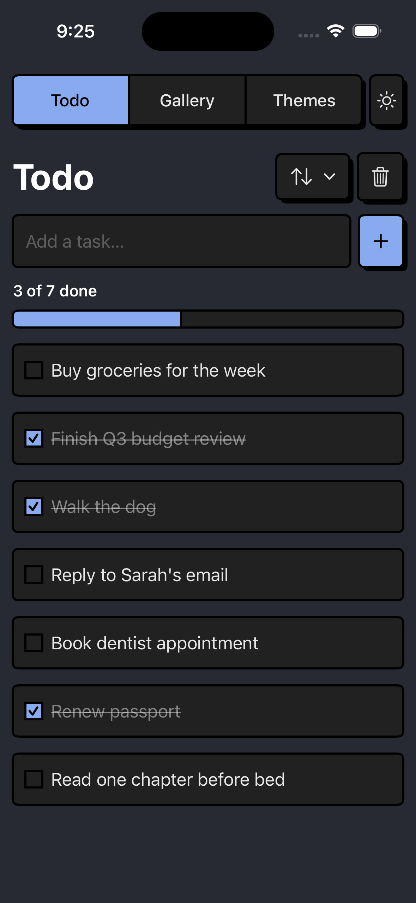
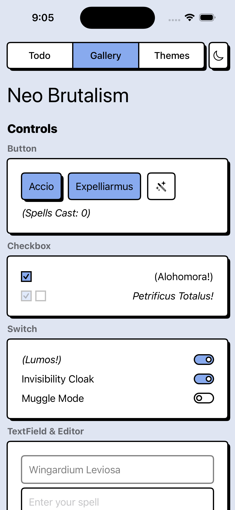
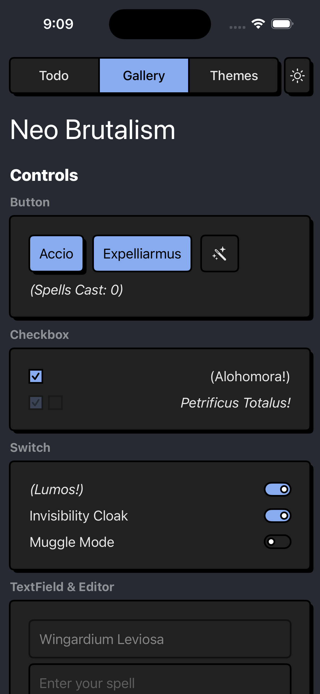
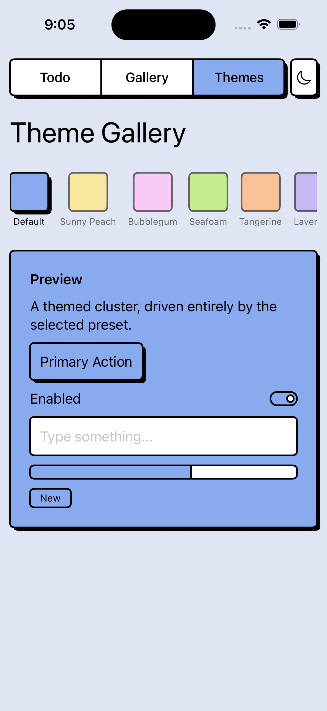
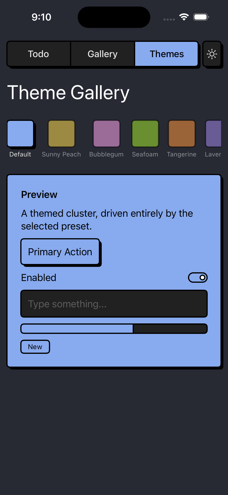

<picture>
  <source media="(prefers-color-scheme: dark)" srcset="docs/media/logo-dark.svg">
  
</picture>

     

# NeoBrutalism

```swift
struct ContentView: View {
    @State private var shieldOn = false

    // Plain SwiftUI…
    var body: some View {
        VStack(spacing: 16) {
            Toggle("Shield Charm", isOn: $shieldOn)
            Button("Cast Spell") {}
        }
        .padding()
        // …one modifier later:
        .neoBrutalism()
    }
}
```

<p align="center">
  
</p>

Native SwiftUI controls, restyled through standard style protocols — keep your code, your accessibility, your behavior.

## Quick start

Add NeoBrutalism with Swift Package Manager:
1. In Xcode, go to File → Add Package Dependencies.
1. Enter the repository URL: `https://github.com/rational-kunal/NeoBrutalism.git`
1. Choose the version or branch you want to use.

Two lines to a fully styled app:

```swift
import NeoBrutalism
import SwiftUI

ContentView()
    .neoBrutalism(applyBackground: true)
```

Want a different look? Swap the theme, same call:

```swift
ContentView().neoBrutalism(theme: .bubblegum, applyBackground: true)
```

<p align="center">
  
</p>

See [Theming](#theming) for what each preset changes beyond color, and how to build your own.

## What gets styled

| Layer | Covers | How |
|---|---|---|
| Root modifier | [Button](#button) · [Checkbox/Switch](#checkbox) · [Input](#input) · [Progress](#progress)/Gauge · Label · LabeledContent · [Menu](#menu) trigger · [Accordion](#accordion) · Control Group · [Card](#card-group-box) | one `.neoBrutalism()` call, zero per-view modifiers |
| Helpers | [List & Form](#list--form) · [Navigation](#navigation) bars · [Input](#input) editor · [Drawer](#drawer) sheets · Dialog alerts · [Swipe Actions](#swipe-actions) · [Skeleton loading](#skeleton-modifier) | `nbList()`/`nbListRow()` · `nbNavigationBar()` · `nbTextEditor()` · `nbDrawer()` · `nbDialog()` · `nbSwipeActions()` · `nbSkeleton()` |
| Drop-in views | [Slider](#slider) · [Stepper](#stepper) · Segmented picker · [Radio](#radio) · [Tabs](#tabs) · [Alert](#alert) · [Badge](#badge) · [Collapsable](#collapsable) · [Skeletons](#round-skeleton) | `NBSlider` · `NBStepper` · `NBSegmentedPicker` · `NBRadioGroup` · `NBTabView` · `NBAlert` · `NBBadge` · `NBCollapsable` · `NBRoundSkeleton`/`NBTextSkeleton` |

SwiftUI gives no style protocol for `List`/`Form` or navigation chrome, so the root modifier can't
reach them — style those with the helpers above. Controls with no native style protocol at all
(Slider, Stepper, segmented Picker, Radio, …) ship as drop-in `NB*` views that mirror the native
initializer shape.

## A real screen, one modifier

The Example app opens on a small todo app. The text field, add button, progress bar,
checkboxes, list rows, sort menu, and the "delete all" dialog are all styled by a single
`.neoBrutalism()` call at the root of the screen — the whole file contains exactly two
per-view style modifiers, and both are deliberate design choices, not workarounds.

<p align="center">
  
  
</p>

The shape of it:

```swift
var body: some View {
    VStack {
        TextField("Add a task…", text: $newTodoText)  // nothing on this…
        Button(action: addTodo) { Image(systemName: "plus") }  // …or this…
        ProgressView(value: progress)                 // …or this…
        List { /* rows via nbListRow() */ }
    }
    .neoBrutalism()                                   // …one call styles it all
}
```

The full source is [TodoView.swift](Example/Sources/TodoView.swift) — about 200 lines. Open
[Example](Example/) in Xcode and run it to poke around; the screenshots and demo GIF in this
README come from [capture.sh](Example/capture.sh) in that folder.

## Built with NeoBrutalism
- [Mismatch](https://github.com/rational-kunal/mismatch)
- _Building something with NeoBrutalism? [Open a PR](https://github.com/rational-kunal/NeoBrutalism/pulls) adding it here._

## Components

Everything below is also live in the Example app's Gallery tab, grouped the same way — handy
if you'd rather tap through things than scroll a README.

<p align="center">
  
  
</p>


### Checkbox
<p float="left">
    
    
<p>

```swift
Toggle(isOn: $checkboxState) { Text(checkboxState ? "(Alohomora!)" : "(Colloportus!)") }
    .toggleStyle(.neoBrutalismCheckbox)
```

### Switch
<p float="left">
    
    <br />
    
</p>

The root modifier's default `Toggle` style is the switch (matching native semantics):

```swift
Toggle(isOn: $switchState) { Text(switchState ? "(Lumos!)" : "(Nox!)") }
    .toggleStyle(.neoBrutalismSwitch)
```
### Accordion
<p float="left">
    
    
<p>

```swift
DisclosureGroup("Expecto Patronum") {
    Text("Pitradev Sanrakshanam - पितृदेव संरक्षणम्")
}.disclosureGroupStyle(.neoBrutalism)
```

### Button
<p>
    
    
<br />

</p>

```swift
Button {
    counter += 1
} label: {
    Text("Accio")
}.buttonStyle(.neoBrutalism())

Button {
    counter += 1
} label: {
    Image(systemName: "wand.and.sparkles.inverse")
        .bold()
}.buttonStyle(.neoBrutalism(type: .neutral, variant: .reverse))
```

### Card (Group Box)

The native `GroupBox` gets the card look with a single style — its label becomes the
card header. It is also applied automatically by the `.neoBrutalism()` root modifier.

<p>
    
    
<br />

```swift
GroupBox("Hogwarts Letter") {
    Text("You have been accepted to Hogwarts School of Witchcraft and Wizardry!")

    Button {
        // No-op
    } label: {
        Text("Open Letter").frame(maxWidth: .infinity)
    }.buttonStyle(.neoBrutalism())
}
.groupBoxStyle(.neoBrutalism())

// Neutral surface, and/or flat (no drop shadow, tighter padding):
GroupBox("Marauder's Map") {
    Text("I solemnly swear that I am up to no good.")
}
.groupBoxStyle(.neoBrutalism(type: .neutral, elevated: false))
```

### Input

<p>
    
    
</p>

```swift
TextField("Enter your spell", text: $text)
    .textFieldStyle(.neoBrutalism)

SecureField("Password", text: $password)
    .textFieldStyle(.neoBrutalism)

TextEditor(text: $notes)
    .nbTextEditor()
    .frame(height: 120)
```

### Progress

<p>
    
    <br />
    
</p>

```swift
ProgressView(value: 0.7)
    .progressViewStyle(.neoBrutalism)
```

### Slider

<p>
    
    <br />
    
</p>

`NBSlider` takes any `BinaryFloatingPoint` value and matches the native `Slider` initializer shape, so swapping it in doesn't change your call sites.

```swift
@State var volume: Double = 30

// Basic slider with range and step
NBSlider(value: $volume, in: 0...100, step: 5)

// Slider with 0…1 range (default)
NBSlider(value: .constant(0.52))
```

**Parameters:**
- `value` — a binding to a floating-point value
- `bounds` — the closed range of valid values (default: `0...1`)
- `step` — optional increment to snap to
- `onEditingChanged` — called with `true` on drag start, `false` on drag end

Accessibility: exposes an adjustable element; works with VoiceOver to adjust the value.

### Stepper

<p>
    
    <br />
    
</p>

`NBStepper` steps an integer value up and down. Hold the +/– buttons and it auto-repeats.

```swift
@State private var quantity = 1

// Basic stepper with default step of 1
NBStepper("Quantity", value: $quantity, in: 0...10)

// Stepper with custom step
NBStepper("Price", value: $price, in: 0...100, step: 5)

// Custom label
NBStepper(value: $quantity, in: 0...10) {
    Label("Items", systemImage: "cart")
}
```

**Parameters:**
- `value` — a binding to an integer value
- `range` — the closed range of valid values
- `step` — the increment/decrement step (default: 1)
- `label` — an optional view describing the stepper's purpose

Accessibility: exposes one adjustable element; works with VoiceOver to increment/decrement by the configured step.

### Radio

<p>
    
    
</p>

```swift
struct RadioGroupExampleView: View {
    @State private var selectedSpell: Int = 0

    var body: some View {
        VStack(alignment: .leading, spacing: 8.0) {
            Text("Selected Spell: \(selectedSpell)")
                .font(.title3)

            NBRadioGroup(value: $selectedSpell) {
                VStack(alignment: .leading) {
                    NBRadioItem(value: 0) {
                        Text("Expelliarmus")
                    }
                    NBRadioItem(value: 1) {
                        Text("Lumos")
                    }
                    NBRadioItem(value: 2) {
                        Text("Wingardium Leviosa")
                    }
                }.frame(maxWidth: .infinity, alignment: .leading)
            }
        }
    }
}
```

### Tabs
<p>
    
    
</p>

```swift
struct TabsExampleView: View {
    @State private var selectedTab: Int = 0

    var body: some View {
        NBTabView(selection: $selectedTab) {
            NBTab(value: 0) {
                GroupBox { Text("Bravery and Daring!") }
            } label: {
                Image(systemName: "flame.fill")
            }
            NBTab(value: 1) {
                GroupBox { Text("Cunning and Ambition!") }
            } label: {
                Image(systemName: "lanyardcard.fill")
            }
            NBTab(value: 2) {
                GroupBox { Text("Wisdom and Learning!") }
            } label: {
                Image(systemName: "book.fill")
            }
        }
        .groupBoxStyle(.neoBrutalism(elevated: false))
    }
}
```

### Collapsable

<p>
    
    
</p>

```swift
NBCollapsable(isExpanded: $isExpanded) {
    GroupBox {
        HStack {
            Text("Need something?")
            Spacer()
            NBCollapsibleTrigger {
                Image(systemName: isExpanded ? "door.left.hand.open" : "door.left.hand.closed")
            }
        }
    }
    .groupBoxStyle(.neoBrutalism(elevated: false))
    NBCollapsableContent {
        GroupBox {
            Text("Here’s what you need!")
        }
        .groupBoxStyle(.neoBrutalism(type: .neutral, elevated: false))
    }
}
```

### Drawer

<p>
    
    
</p>

```swift
struct DrawerExampleView: View {
    @State private var isDrawerOpen: Bool = false

    var body: some View {
        VStack(spacing: 16.0) {
            NBButton {
                Text("Open the Chamber")
            } action: {
                isDrawerOpen.toggle()
            }
        }
        .nbDrawer(isPresented: $isDrawerOpen) {
            VStack(spacing: 16) {
                Text("Parseltongue Required")
                    .font(.title2)

                Text("Only those who can speak to snakes may proceed.")
                    .padding(.horizontal, 4.0)

                NBButton {
                    Text("I Understand")
                } action: {
                    isDrawerOpen.toggle()
                }
            }
        }
    }
}
```

### Navigation

Apply `.nbNavigationBar()` to style the navigation bar with the neobrutalism theme. Use it inside a `NavigationStack` on the screen content.

```swift
NavigationStack {
    ContentView()
        .navigationTitle("Navigation Title")
        .nbNavigationBar()
}
.neoBrutalism()
```

**Note:** Toolbar buttons automatically pick up `NBButtonStyle` from the root modifier. If styles reset in your toolbar context, explicitly apply `.buttonStyle(.neoBrutalism(type: .neutral))` to the toolbar item.

### Alert
<p float="left">
    
    
<p />

```swift
NBAlert("Warning", message: "The Chamber of Secrets has been opened. Enemies of the heir, beware!",
        systemImage: "exclamationmark.triangle")

NBAlert("Caution", message: "Dementors are nearby. Expecto Patronum!", type: .neutral)

// For custom View types, use the builder form:
NBAlert {
    Text("Custom message content")
} icon: {
    Image(systemName: "exclamationmark.triangle")
} head: {
    Text("Custom Title")
}
```

### Badge

<p>
    
    <br />
    
</p>

```swift
NBBadge {
    Text("Gryffindor")
        .font(.title3)
}
NBBadge(type: .neutral) {
    Text("Slytherin")
}
```

### Round Skeleton

<p>
    
    <br />
    
</p>

```swift
GroupBox {
    NBRoundSkeleton()
}
.groupBoxStyle(.neoBrutalism(elevated: false))
.frame(width: 120, height: 120)
```

### Text Skeleton
<p>
    
    
</p>

```swift
VStack(alignment: .leading, spacing: 12.0) {
    NBTextSkeleton()

    NBTextSkeleton()
        .frame(width: 120)
}
```

### Skeleton Modifier

Replaces any view with a pulsing skeleton placeholder while loading. The skeleton inherits the
size and layout of the wrapped view.

```swift
@State var isLoading = true

HStack(spacing: 12.0) {
    Image(systemName: "person.crop.circle.fill")
        .resizable()
        .frame(width: 48, height: 48)

    VStack(alignment: .leading, spacing: 4.0) {
        Text("Profile Name")
        Text("@username").font(.caption)
    }
}
.nbSkeleton(active: isLoading)
```

### Menu

`NBMenu` provides a fully themed dropdown menu — both trigger and items. The dropdown renders in
a separate overlay window so it appears above the entire app, even inside scrolling containers.

```swift
NBMenu {
    NBMenuItem("Edit", systemImage: "pencil") { edit() }
    NBMenuItem.divider
    NBMenuItem("Share", systemImage: "square.and.arrow.up", disabled: true) { }
    NBMenuItem("Delete", systemImage: "trash", role: .destructive) { delete() }
} label: {
    Text("Options")
}
```

Features:
- **Divider rows** with `NBMenuItem.divider` to group related actions
- **Disabled items** with the `disabled:` parameter — renders at 50% opacity and non-interactive
- **Long menus** automatically scroll when they exceed 60% of screen height

### List & Form

SwiftUI exposes no style protocol for `List`/`Form`, so the `.neoBrutalism()` root modifier
can't reach them. Style the container with `nbList()` and each row with `nbListRow()`: the
helpers hide the system background and separators and render every row as a neobrutalist card.
`Form` is a `List` under the hood, so the same helpers apply.

```swift
@Environment(\.nbTheme) private var theme

List {
    ForEach(items) { item in
        Text(item.title)
            .nbListRow()
            .swipeActions(edge: .trailing) {
                Button(role: .destructive) {
                    items.removeAll { $0 == item }
                } label: {
                    Label("Delete", systemImage: "trash")
                }
                .tint(theme.destructive)
            }
    }
}
.nbList()
```

**Native swipe-to-delete ceiling:** SwiftUI's native swipe reveal can only be *tinted*
(`.tint(theme.destructive)`) and *labelled* — its border stroke and square corners are
system-owned and can't be restyled (and `ForEach.onDelete` gives even less: a fixed,
un-tintable "Delete"). For a fully neobrutalist drag-to-reveal action — bordered tiles, square
corners, press language — use the custom `nbSwipeActions` component below.

### Swipe Actions

`nbSwipeActions` is a themed, bordered alternative to SwiftUI's `.swipeActions` for rows in a
`LazyVStack`/`ScrollView`. Where native swipe reveal can only be tinted, `nbSwipeActions` renders
real neobrutalist tiles — thick border, `theme.destructive` fill, square corners — flush against
the row edge (no offset shadow on the revealed tiles, since they sit inline with the row).

```swift
LazyVStack(spacing: 8.0) {
    ForEach(items) { item in
        ItemRow(item)
            .nbListRow()
            .nbSwipeActions(actions: [
                NBSwipeAction("Pin", systemImage: "pin.fill", tint: .blue) {
                    pin(item)
                },
                NBSwipeAction("Delete", systemImage: "trash", role: .destructive) {
                    delete(item)
                }
            ])
    }
}
```

- Drag from `edge` (default `.trailing`) to reveal; past ~60% of the row width with
  `allowsFullSwipe` (default `true`), releasing runs the first action directly.
- `role: .destructive` fills with `theme.destructive`/`theme.destructiveText`; otherwise
  `tint ?? theme.main`/`theme.mainText`.
- Every action is also exposed as a named VoiceOver/Switch Control accessibility action, so it's
  reachable without performing the drag gesture.

**Not for `List`:** List owns its own pan gesture and fights a custom one — use native
`.swipeActions` + `.tint(theme.destructive)` there instead (see List & Form above).

## Theming

NeoBrutalism themes every component through one `NBTheme` value, read from the environment.
Override it for a subtree with `.nbTheme(_:)`, or derive a variant with `updateBy(...)`:

```swift
struct ContentView: View {
    var theme = NBTheme.default.updateBy(background: .black, mainText: .white)

    var body: some View {
        ZStack {
            theme.background
                .ignoresSafeArea()
            Toggle(isOn: .constant(true)) { Text("Are you a wizard?") }
                .toggleStyle(.neoBrutalismCheckbox)
        }.nbTheme(theme)
    }
}
```

**Available tokens:**
- **Colors**: `main`, `bw`, `overlay`, `background`, `blank`, `border`, `text`, `mainText`, `destructive`, `destructiveText`
- **Spacing**: `smsize`, `size`, `xlsize`, `smpadding`, `padding`, `xlpadding`, `smspacing`, `spacing`, `xlspacing`
- **Shadow**: `boxShadowX`, `boxShadowY`
- **Borders**: `borderWidth`, `borderRadius`
- **Typography**: `fontDesign` — applies a `Font.Design` (e.g., `.rounded`) to the entire hierarchy via the root modifier

**Preset themes:** ship five bundled looks besides `.default`, each a drop-in for the `theme:` argument of `.neoBrutalism(theme:)` / `.nbTheme(_:)`. They vary more than color — corner radius, border weight, shadow depth, padding/spacing density, and font design each give the presets a distinct personality:
- `.sunnyPeach` — warm yellow on peach (the classic look)
- `.bubblegum` — pink on blush; pillowy capsule corners, airy padding, rounded font
- `.seafoam` — lime on sage; square corners, slab border, block shadow, monospaced font
- `.tangerine` — orange on cream; thick border and a huge poster-style shadow
- `.lavender` — purple on lilac; serif font, hairline border, completely flat (no shadow)

<p align="center">
  
  
</p>

```swift
ContentView().neoBrutalism(theme: .bubblegum, applyBackground: true)
```

## Architecture

```
NeoBrutalism (Swift Package, iOS 17+)
│
├── Sources/NeoBrutalism/
│   ├── Common/
│   │   ├── Theme.swift             # NBTheme — colors, spacing, shadow tokens
│   │   ├── Theme+Presets.swift     # sunnyPeach/bubblegum/seafoam/tangerine/lavender
│   │   ├── NeoBrutalismModifier    # .neoBrutalism() root modifier
│   │   ├── NeoBrutalismBoxModifier # Shared border + drop-shadow ViewModifier
│   │   └── Equatable+               # Equatable helpers
│   │
│   ├── Internal/
│   │   └── NeoBrutalismPreviewHelper  # Canvas preview utilities
│   │
│   └── Components/
│       ├── Button.swift            # ButtonStyle (.neoBrutalism)
│       ├── GroupBox/               # GroupBoxStyle (.neoBrutalism) — card look for native GroupBox
│       ├── Badge.swift             # NBBadge — inline label
│       ├── Alert.swift             # NBAlert — icon + head + body
│       ├── Input.swift             # TextFieldStyle (.neoBrutalism)
│       ├── Progress.swift          # ProgressViewStyle (.neoBrutalism)
│       ├── Slider.swift            # NBSlider — generic value/range/step drag slider
│       ├── Stepper/                # NBStepper — increment/decrement with auto-repeat
│       ├── Drawer.swift            # .nbDrawer() — bottom sheet
│       ├── Dialog.swift            # .nbDialog() — centered modal (alert replacement)
│       ├── Collapsable.swift       # NBCollapsable + Trigger + Content
│       ├── Accordion/              # DisclosureGroupStyle (.neoBrutalism)
│       ├── Radio/                  # NBRadioGroup + NBRadioItem + Indicator
│       ├── Tabs/                   # NBTabView + NBTab — inline tab view
│       ├── Menu/                   # MenuStyle (.neoBrutalism) + NBMenu dropdown
│       ├── SwipeActions/           # nbSwipeActions() — themed drag-to-reveal row actions
│       └── Skeleton/               # NBRoundSkeleton + NBTextSkeleton + nbSkeleton()
│
├── Tests/NeoBrutalismTests/        # Snapshot test suites (light + dark)
│   └── __Snapshots__/
│
└── Example/                        # Standalone iOS Xcode demo app
    └── Sources/
        ├── ExampleApp.swift        # App entry point
        ├── ContentView.swift       # Tab shell + grouped component gallery
        ├── TodoView.swift          # Flagship: a real todo app, one `.neoBrutalism()` call
        └── ThemeGalleryView.swift  # Live theme picker (preset gallery)
```

**Key design decisions:**
- `NBTheme` is injected via SwiftUI `@Environment` — components read it automatically, consumers override it with `.nbTheme()`
- All visual styling funnels through `NeoBrutalismBoxModifier` for consistent border + shadow
- Toggle-based components (Checkbox, Switch) use native `ToggleStyle`; tab/disclosure use native `DisclosureGroupStyle` — no custom gesture reimplementations
- Snapshot tests run in both light and dark mode against stored reference images

## Contributing

Found a bug, or missing a component you need? Open an issue or send a PR — both are welcome.
[Plans/README.md](Plans/README.md) and [ROADMAP.md](ROADMAP.md) show how ongoing work is
scoped and tracked, if you want to pick something up.

---

<small>The credit for the design belongs to https://www.neobrutalism.dev.<small>
