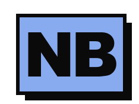
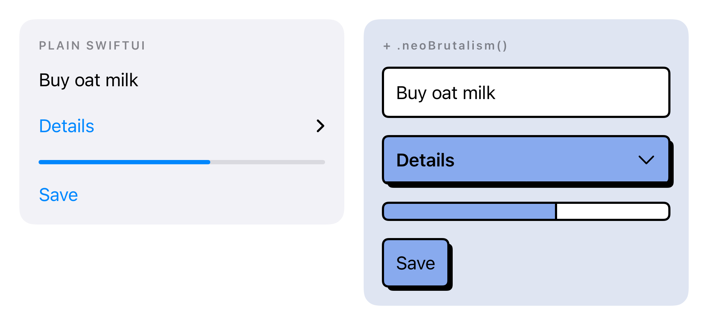
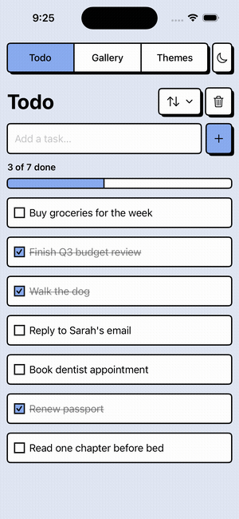
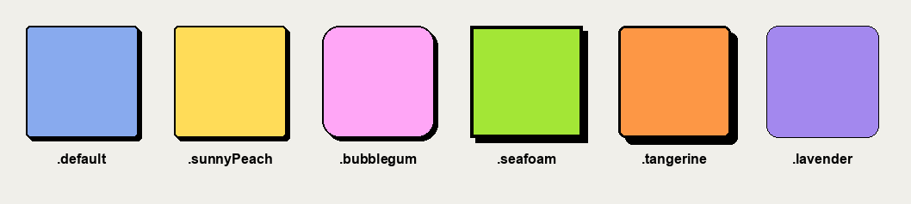

<picture>
  <source media="(prefers-color-scheme: dark)" srcset="docs/media/logo-dark.svg">
  
</picture>

[](https://github.com/rational-kunal/NeoBrutalism/actions/workflows/ci.yml) [](https://rational-kunal.github.io/NeoBrutalism/documentation/neobrutalism)     

# NeoBrutalism

**Make a plain SwiftUI app look designed — in one line.**

Add `.neoBrutalism()` at the root and every native control underneath picks up thick borders, hard
shadows, and a matching palette. Your `Button` is still a `Button` — same code, same accessibility,
nothing to migrate.

> [!NOTE]
> Every line here was once typed by hand. Then the AI revolution happened — so these days most
> changes come with a copilot riding shotgun. The taste is still mine; the typing, less so.

<p align="center">
  <picture>
    <source media="(prefers-color-scheme: dark)" srcset="docs/media/before-after-dark.png">
    
  </picture>
</p>

<p align="center"><sub>Identical SwiftUI on both sides. The only difference is one modifier.</sub></p>

## Install

In Xcode: **File → Add Package Dependencies**, then paste:

```
https://github.com/rational-kunal/NeoBrutalism.git
```

Then two lines in your app:

```swift
import NeoBrutalism

ContentView()
    .neoBrutalism(applyBackground: true)
```

That's the whole setup. iOS 17+ · Swift 6 · zero runtime dependencies.

## 30 components

One modifier covers `Button`, `Toggle`, `TextField`, `ProgressView`, `Gauge`, `Label`, `Menu`,
`DisclosureGroup`, `GroupBox` and more, straight through SwiftUI's own style protocols. Lists,
navigation bars, sliders, tabs, and pickers take one extra line each.

<p align="center">
  
</p>

**[→ Every component and the exact line to type](https://rational-kunal.github.io/NeoBrutalism/documentation/neobrutalism/whatdoitype)**

## Six themes

Swap the whole look in the call you already made:

```swift
ContentView().neoBrutalism(theme: .bubblegum, applyBackground: true)
```

<p align="center">
  
</p>

They vary more than color — corner radius, border weight, shadow depth, padding, and font design
each give them a personality. Or build your own from a token set.

## Documentation

| | |
|---|---|
| [**What do I type?**](https://rational-kunal.github.io/NeoBrutalism/documentation/neobrutalism/whatdoitype) | Every component and the one line that gives it to you. |
| [**Getting Started**](https://rational-kunal.github.io/NeoBrutalism/documentation/neobrutalism/gettingstarted) | Install it and style your first screen. |
| [**Components**](https://rational-kunal.github.io/NeoBrutalism/documentation/neobrutalism/components) | A page each — every variant and state, light and dark, code to paste. |
| [**Theming**](https://rational-kunal.github.io/NeoBrutalism/documentation/neobrutalism/theming) | Tokens, presets, and building a theme from scratch. |

Want to poke at a real app? Open [Example](Example/) in Xcode — a todo screen, a component gallery,
and a live theme switcher.

<sub>Backed by 119 snapshot tests across light and dark, recorded on a pinned simulator by CI.
Semver; breaking changes only in majors.</sub>

## Built with NeoBrutalism

- [Mismatch](https://github.com/rational-kunal/mismatch)

Shipped something with it? [Open a PR](https://github.com/rational-kunal/NeoBrutalism/pulls) and add
yourself — side projects very much welcome.

## Contributing

Bugs and missing components are both worth an issue. [CONTRIBUTING.md](CONTRIBUTING.md) covers dev
setup and the PR checklist; [ROADMAP.md](ROADMAP.md) shows what's planned.

If this saved you an afternoon of styling, a ⭐ helps other people find it.

---

<small>The credit for the design belongs to <a href="https://www.neobrutalism.dev">neobrutalism.dev</a>.</small>
